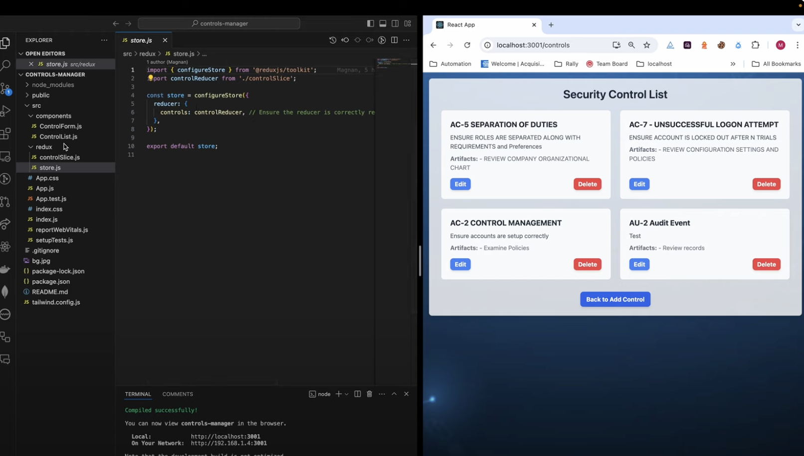
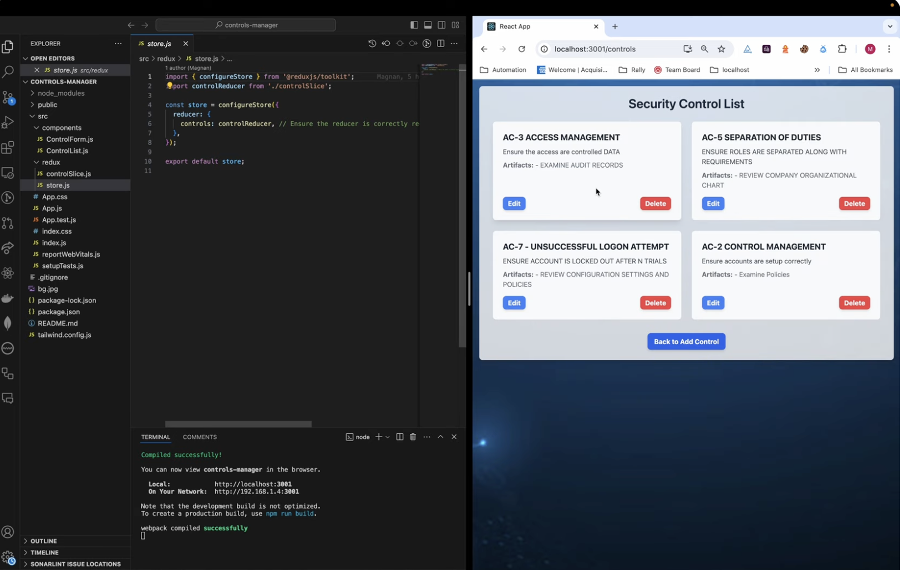
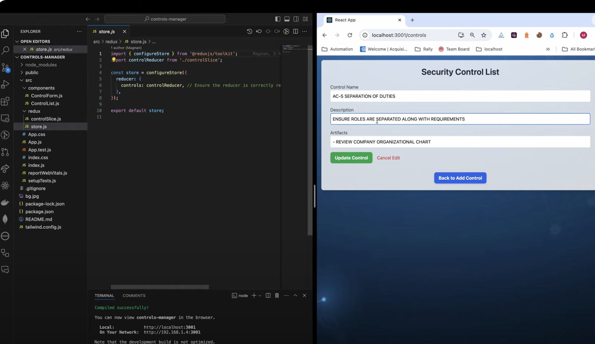
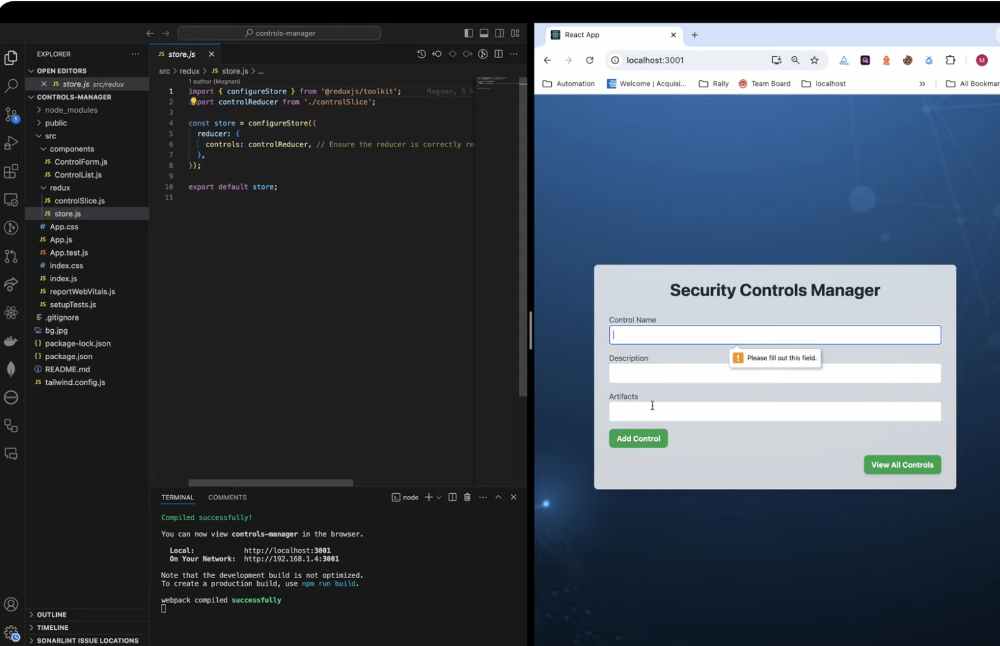

## Project #3

**Security Controls Manager**

Give a high-level overview of the project purpose:
- **What are the users?**
  - Security teams and IT professionals who need to document and manage security controls.
- **What job does it perform for them?**
  - Provides functionality to add, edit, delete, and view security controls along with their descriptions and artifacts.
- **What inspired you to make it?**
  - The need for an organized system to manage and document security controls efficiently.
- **What features are the most important?**
  - CRUD operations for managing security controls.
  - Persistent storage using **LocalStorage** to ensure data remains available across browser sessions.
  - State management using **Redux**.
  - Responsive design with **Tailwind CSS**.

### STAR Interview Questions:
- **(Situation):**
  - The Security Controls Manager was created to streamline the process of managing security controls by enabling CRUD operations with persistent storage.
- **(Task):**
  - Design and build a frontend application that allows users to manage security controls efficiently, ensuring data persists even after closing the browser.
- **(Action):**
  - Developed the application using **React** for the frontend.
  - Managed state using **Redux**, integrating **redux-persist** to sync data with **LocalStorage**.
  - Styled the application with **Tailwind CSS** for a modern and responsive design.
- **(Result):**
  - Delivered a fully functional Security Controls Manager that supports adding, editing, deleting, and viewing controls with persistent storage.

### Screenshots
**Main App Interface**:



**Control Editing Interface**:




---

## Technologies
- **React**: For building the frontend interface.
- **Redux**: For state management.
- **redux-persist**: For syncing Redux state with LocalStorage.
- **Tailwind CSS**: For responsive and modern styling.
- **LocalStorage**: For persistent data storage across browser sessions.

### Dependencies
- Installed via `package.json`. Run:
  ```bash
  npm install

## Competencies

### JF 2.5: Can implement a responsive User Interface

- **Situation**: The project required a responsive and user-friendly interface for managing security controls.
- **Actions Taken**:
  - Used Tailwind CSS to ensure the application layout adjusts seamlessly across devices.
  - Implemented dynamic and interactive UI components using React.
- **Results**:
  - Delivered a fully responsive interface that provides a smooth user experience across all screen sizes.
- **Connection**: This competency highlights my ability to create responsive and intuitive user interfaces.

---

### JF 3.4: Can create a logical and maintainable codebase

- **Situation**: The project needed clean and maintainable code to support CRUD operations and state management.
- **Actions Taken**:
  - Applied modular design principles in building React components.
  - Organized state management logic using Redux for clarity and maintainability.
- **Results**:
  - Ensured a well-structured and maintainable codebase that facilitates easy updates and scalability.
- **Connection**: Demonstrates my ability to write clean, logical, and maintainable code.

---

### JF 4.6: Can test code and analyze results to correct errors found using unit testing

- **Situation**: Ensuring the reliability of components and functions was essential for this project.
- **Actions Taken**:
  - Wrote unit tests for critical components using tools like Jest.
  - Debugged and refined code based on test results to address any issues.
- **Results**:
  - Delivered a reliable and error-free application with tested functionality.
- **Connection**: This competency showcases my ability to write and implement unit tests to ensure code reliability.

---

### JF 5.5: Understands and can apply structured techniques to problem solving, can debug code and can understand the structure of programs to identify and resolve issues

- **Situation**: Debugging and resolving errors were crucial to ensuring the app's functionality.
- **Actions Taken**:
  - Applied debugging techniques to identify issues in state management and UI components.
  - Used Chrome DevTools and other debugging tools to streamline the debugging process.
- **Results**:
  - Successfully identified and resolved issues, delivering a smooth and functional application.
- **Connection**: Highlights my structured approach to debugging and problem-solving.
