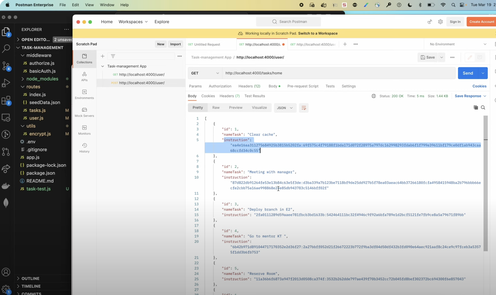
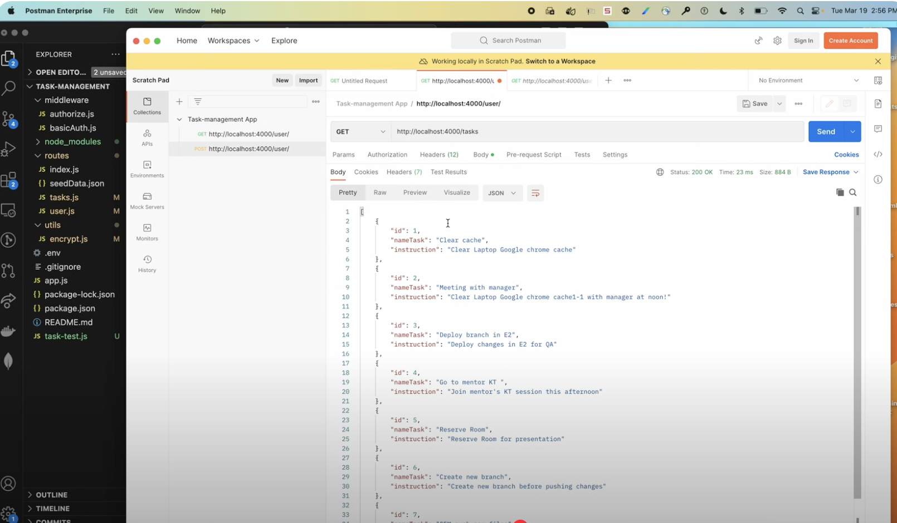
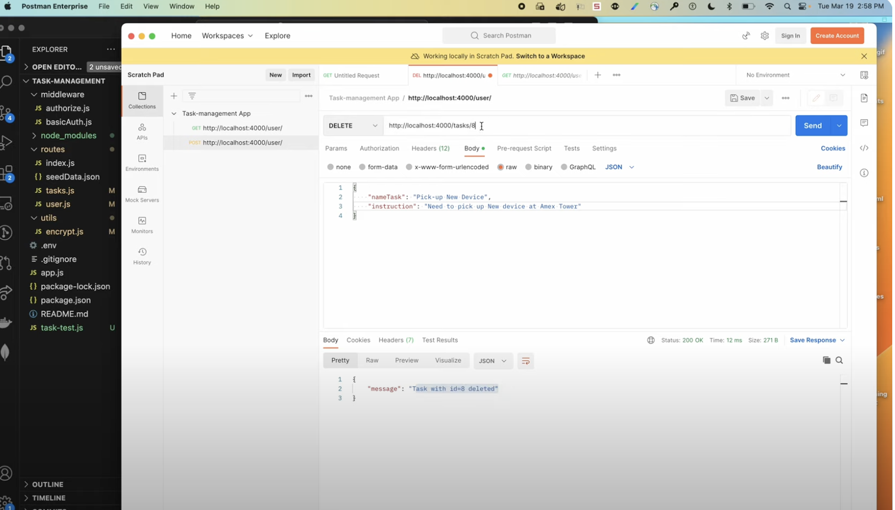
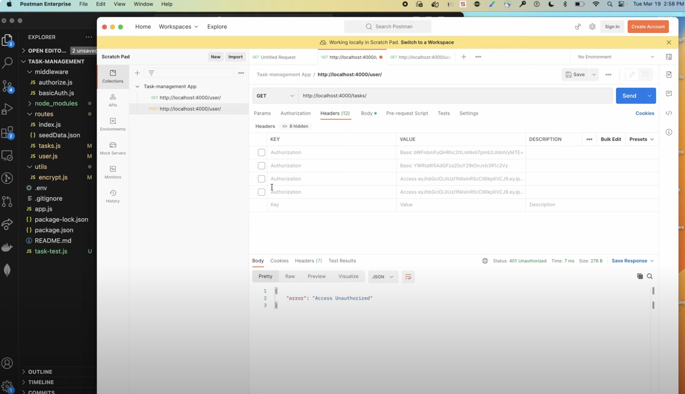

## Project #1
**Task Management API**

Give a high-level overview of the project purpose:
- **What are the users?** 
  - Developers or organizations needing a secure backend for task management.
- **What job does it perform for them?** 
  - Allows users to securely create, store, and manage tasks using encrypted data storage and secure authentication.
- **What inspired you to make it?** 
  - The inspiration came from the need to build secure backend systems that implement encryption and access control following best practices.
- **What features are the most important?**
  - AES256-based encryption for sensitive task data.
  - Token-based authentication (JWT) for secure access.
  - RESTful API endpoints for CRUD operations on tasks.
  - User creation and authentication using basic auth.

### STAR Interview Questions:
- **(Situation):**
  - The project is a backend API that manages tasks securely with encryption and token authentication. I created this program to showcase secure API development and encryption.
- **(Task):**
  - The design required creating RESTful endpoints for tasks, implementing encryption for sensitive data, and ensuring secure access using JWT.
- **(Action):**
  - Implemented AES256 encryption for task storage using `crypto`.
  - Developed user authentication using basic auth and JWT middleware.
  - Protected all task-related endpoints with token-based authorization.
- **(Result):**
  - The final application provides a secure task management API where tasks are encrypted at rest and can only be accessed by authenticated users.

### Screenshots
**Task Creation Example**:




**Encrypted Task in Database**:



---

## Technologies
- **Node.js** v16.x
- **Express.js** v4.x
- **crypto**: AES256-based encryption/decryption.
- **jsonwebtoken** v8.x: For token-based authentication.
- **bcrypt** v5.x: For password hashing.
- **dotenv**: To manage environment variables.
- **cURL/Postman**: For API testing.
- **OpenSSL**: For generating encryption keys.

### Dependencies
- Installed via `package.json`. Use:
  ```bash
  npm install


### Competencies

### JF 3.6: Can implement a RESTful API
- **Situation**: A task management API was needed to provide CRUD functionality for tasks.
- **Actions Taken**:
  - Built a RESTful API using **Node.js** and **Express**.
  - Ensured secure and encrypted handling of task data.
- **Results**:
  - Delivered a functional API that enables task creation, retrieval, updating, and deletion.
- **Connection**: Demonstrates my ability to implement RESTful APIs that meet functional requirements.

### JF 3.8: Can encrypt sensitive data via hashing
- **Situation**: Task instructions needed secure handling and storage.
- **Actions Taken**:
  - Used **crypto** and **SHA256** to encrypt sensitive task instructions.
- **Results**:
  - Ensured secure storage and retrieval of sensitive task data.
- **Connection**: Highlights my understanding of data encryption to secure sensitive information.