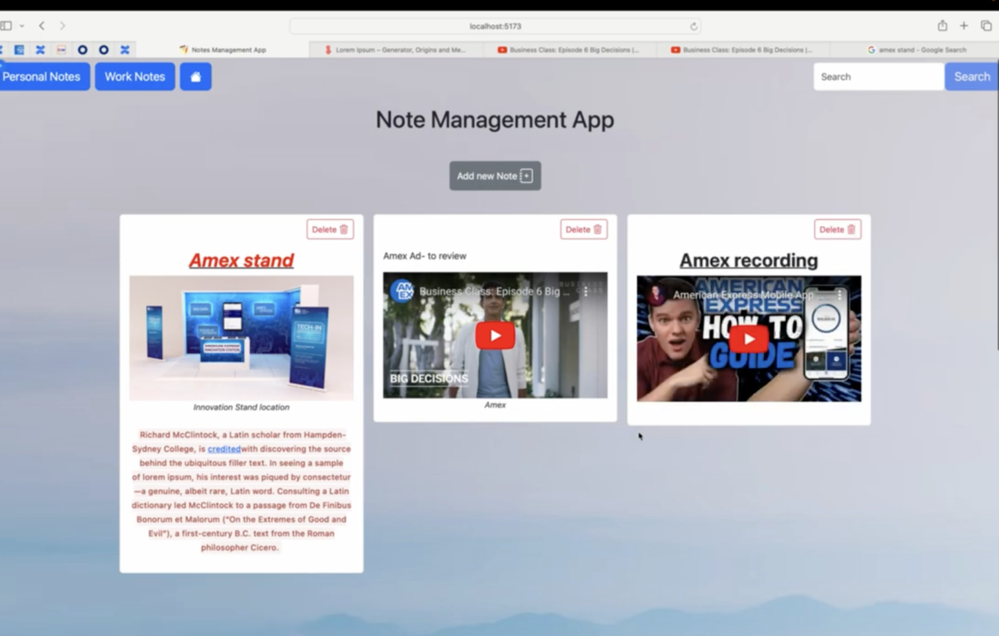

## Project #2

**Notes Management App**

Give a high-level overview of the project purpose:
- **What are the users?**
  - Users looking to efficiently manage and organize notes across personal and work categories.
- **What job does it perform for them?**
  - Allows users to create, read, edit, and delete notes, which can include text, images, and embedded YouTube videos.
- **What inspired you to make it?**
  - Inspired by the need to have a centralized and organized solution for managing notes while keeping the interface simple and responsive.
- **What features are the most important?**
  - CRUD operations (Create, Read, Update, Delete notes).
  - Categorize notes into personal and work sections.
  - Search functionality for finding notes quickly.
  - Support for text, images, and YouTube video embedding.
  - Responsive and flexible grid layout for an enhanced user experience.

### STAR Interview Questions:
- **(Situation):**
  - The Notes Management App is a web-based tool to help users organize their notes effectively with features for text, media, and categorization. It addresses the need for efficient note management.
- **(Task):**
  - The application needed a user-friendly interface for CRUD operations, state management, and responsive design for optimal usability across devices.
- **(Action):**
  - Built the interface using **React** and **Bootstrap** for responsiveness.
  - Used **useState** and **useContext** for state management across components.
  - Integrated **Editor.js** for rich text editing capabilities.
  - Leveraged **LocalStorage** for client-side persistence of notes data.
- **(Result):**
  - Delivered an interactive, flexible, and responsive notes management application with features to create, edit, delete, and organize notes effectively.

### Screenshots
**Main App Interface**:



**Note Editor**:


---

## Technologies
- **React**: For building the user interface and managing component state.
- **Bootstrap**: For responsive design and consistent UI components.
- **React-masonry-css**: For flexible and responsive grid layouts.
- **Editor.js**: A library editor used for text editing.
- **State Management**: React hooks (`useState`, `useContext`) for managing and sharing state.
- **LocalStorage**: For persisting notes data on the client-side.

### Dependencies
- Installed via `package.json`. Run:
  ```bash
  npm install

### Competencies

### JF 2.3: Can develop effective user interfaces
- **Situation**: The project required an intuitive interface for users to manage and organize their notes.
- **Actions Taken**:
  - Built a clean and flexible UI with **React** and **Bootstrap**.
  - Integrated **Editor.js** for rich-text editing features.
- **Results**:
  - Delivered a user-friendly and feature-rich notes management application.
- **Connection**: Highlights my ability to design and develop effective user interfaces that align with user needs.

### JF 3.5: Can apply algorithms, logic, and data structures
- **Situation**: The app required optimized handling of note categorization and retrieval.
- **Actions Taken**:
  - Applied efficient logic for categorizing notes into personal and work sections.
  - Implemented search functionality to allow users to quickly retrieve notes.
- **Results**:
  - Created a seamless experience for note organization and retrieval.
- **Connection**: Demonstrates my ability to apply algorithms and logical thinking for data handling.

---