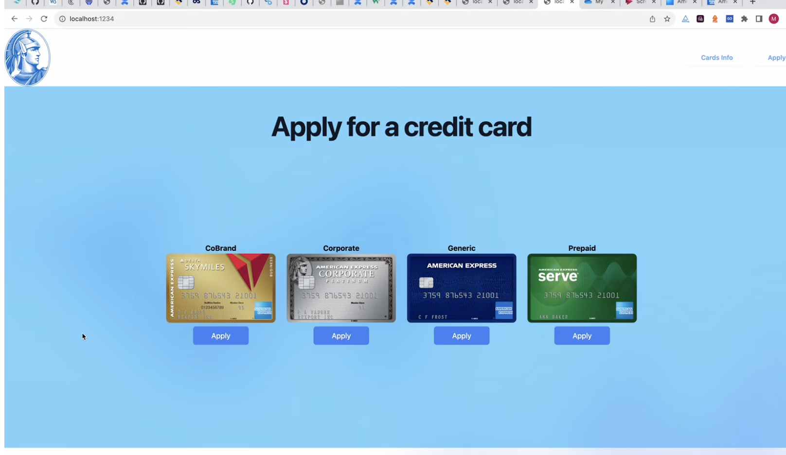
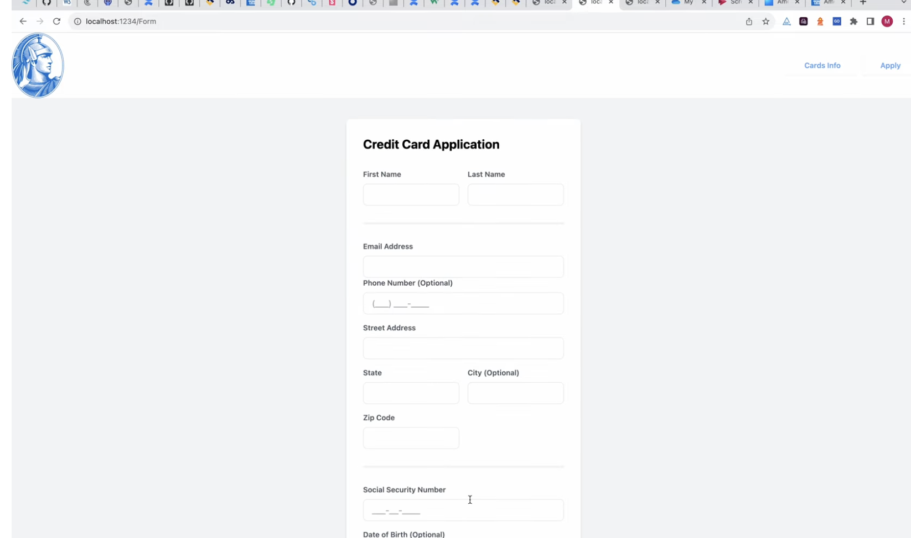
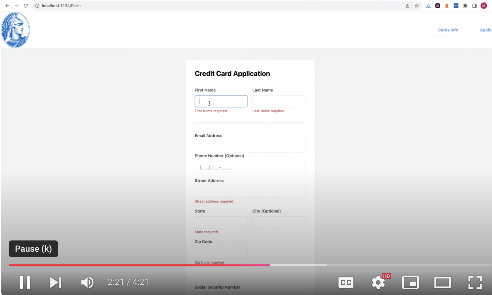
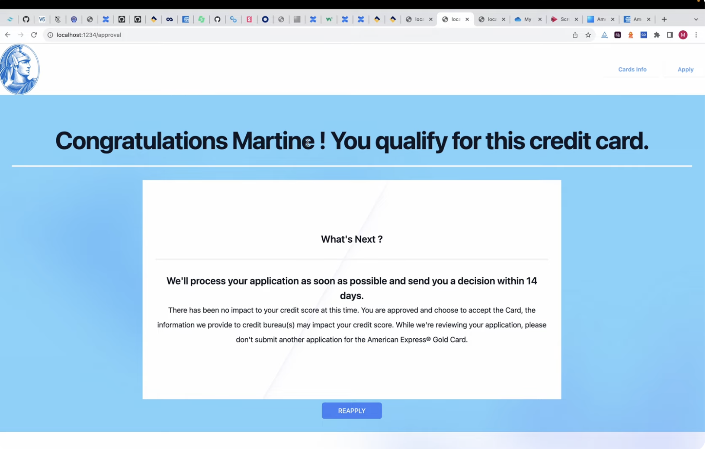
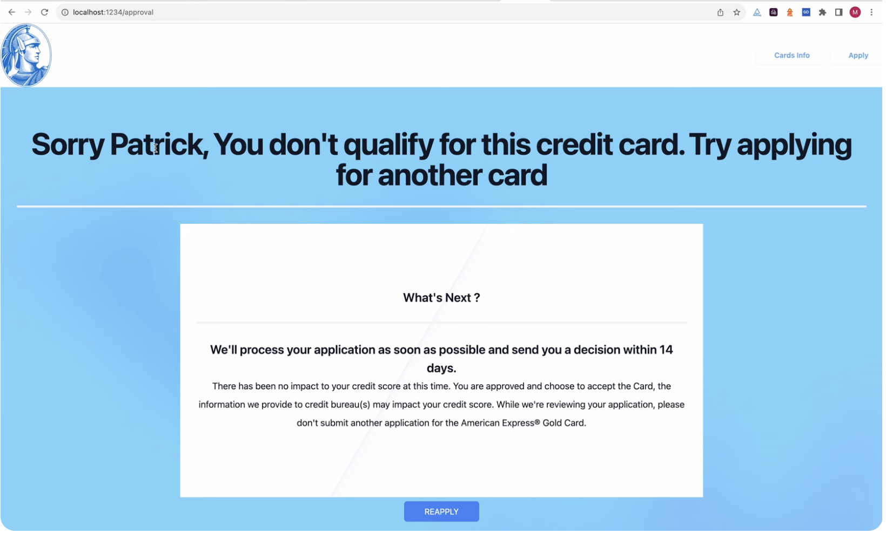

## Project #4

**Credit Card Application Web App**

Give a high-level overview of the project purpose:
- **What are the users?**
  - Consumers applying for credit cards or seeking upgrades.
- **What job does it perform for them?**
  - Allows users to apply for credit cards via a dynamic and interactive web application.
- **What inspired you to make it?**
  - The project was inspired by a real-world use case where US consumers apply for credit cards. It was created as practice to understand credit card application processes before joining a similar team.
- **What features are the most important?**
  - Homepage with credit card options and an “Apply” button.
  - Application form with required fields, validations, and dynamic decision display.
  - Validation errors for missing or incorrect inputs.
  - Responsive design to ensure usability across devices.

### STAR Interview Questions:
- **(Situation):**
  - A credit card application web app was required to simulate real-world workflows of applying for a credit card.
- **(Task):**
  - The goal was to design an application with features such as form submission, validation, decision-making logic, and responsive design.
- **(Action):**
  - Developed a user-friendly homepage and form using **React**.
  - Implemented field validations to ensure required fields are completed.
  - Designed dynamic decision pages based on user input (approval/denial messages).
  - Applied responsive design with **Tailwind CSS** for smooth cross-device experience.
- **(Result):**
  - Delivered an interactive credit card application app that includes form validations, decision logic, and a responsive design.

### Screenshots
**Homepage with Credit Card Options**:


**Application Form**:


**Validation Errors**:


**Approval Page**:


**Denial Page**:


**Shop Page**:


---

## Technologies

- **React**: For building the dynamic and interactive user interface.
- **Tailwind CSS**: For responsive and modern styling.
- **State Management**: React hooks (`useState`) for managing form states.
- **Node.js**: Backend environment for local development (if needed).
- **LocalStorage**: For storing temporary data (e.g., application state).

### Dependencies

- Installed via `package.json`. Run:
  ```bash
  npm install

### Competencies

### JF 2.7: Effectively manages state for complex User Interfaces
- **Situation**: The credit card application required managing complex form inputs and validation states.
- **Actions Taken**:
  - Used **React hooks** to manage form states.
  - Implemented input validation logic to ensure accurate submissions.
- **Results**:
  - Delivered a robust form experience with dynamic validation and state management.
- **Connection**: Demonstrates my ability to handle complex UI states effectively.

### JF 4.4: Can interpret and implement a given design while remaining compliant with security and maintainability requirements
- **Situation**: The project needed a secure and maintainable application form for credit card applications.
- **Actions Taken**:
  - Followed best practices for validation and form security.
  - Ensured the app's maintainability by applying modular design principles.
- **Results**:
  - Delivered a functional, secure, and maintainable application for credit card submission.
- **Connection**: Highlights my ability to interpret designs and prioritize security and maintainability.
